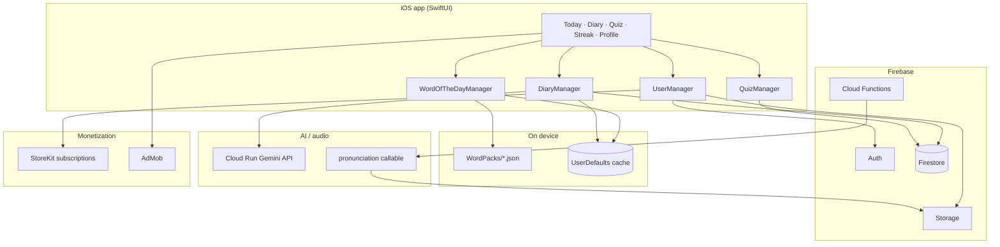

# Maia — Architecture

High-level overview of the **Maia** iOS app and its backend. For setup, see [README](README.md).

## Stack

| Layer | Technology |
|-------|------------|
| **Client** | SwiftUI, StoreKit 2, Google Mobile Ads |
| **Auth** | Firebase Auth (Apple, Google, email) |
| **Data** | Firestore, Cloud Storage, UserDefaults (offline cache) |
| **Server** | Firebase Cloud Functions (Node.js), Cloud Run (FastAPI + Gemini) |
| **AI** | Google Gemini (diary correction, optional example generation) |
| **Audio** | Cloud TTS → Firebase Storage → local MP3 cache |
| **Content** | Bundled `WordPacks/{yyyy-MM}.json` (curated daily words + quizzes) |
| **Hosting** | Firebase Hosting (privacy, support, auth redirect pages) |

## System diagram



## App structure

```
ContentView
├── AuthEntryView          (signed out)
├── InitialSetupView       (profile + CEFR level)
└── MainTabView
    ├── TodayTabView       daily words, pronunciation, quiz entry
    ├── DiaryView          notes + AI sentence suggestions
    ├── StreakView         calendar + optional rewarded recovery
    └── ProfileView        stats, ranks, settings entry
```

State is held in `ObservableObject` managers injected via `.environmentObject` from `MainTabView` and `ContentView`.

## Core flows

### Daily words (primary content path)

1. Calendar day is computed in **Europe/Istanbul** timezone.
2. `WordOfTheDayManager` calls `DailyWordsService.ensureDailyWords`.
3. Words are read from **`maia/WordPacks/{yyyy-MM}.json`** — definitions, examples, and quiz items are pre-authored in JSON.
4. `CEFRLevelMapping` picks **3 words** per day from 12 curated candidates based on the user’s level (1–11).
5. Selected words are **locked in UserDefaults** for the day (offline-first).
6. `WordPronunciationService` prefetches TTS audio via a Firebase callable; MP3s are cached locally.

> Legacy Firestore `dailyWords` scheduling still exists in `functions/` but the shipped app uses bundled WordPacks.

### Quiz

1. `QuizManager` loads **curated questions** from the same WordPack entry for that word + date.
2. On completion, side effects run immediately (diary, streak, stats) — not deferred to a button tap.
3. Free users may see a **daily interstitial** after the first completed quiz (`DailyQuizAdTracker`).

### Diary

1. Words and notes are stored **locally** and synced to `users/{uid}/diary` in Firestore when signed in.
2. **Gemini** (Cloud Run) suggests grammar improvements for user-written example sentences.
3. One-shot Firestore reads/writes; no live listeners (avoids snapshot loops).

### Auth & user data

- `UserManager`: Firebase Auth, profile photo (Storage), StoreKit premium status, Apple/Google sign-in.
- Per-user Firestore paths scope streak, stats, diary, and quiz events.
- Account switch clears local caches to prevent cross-user data leaks.

### Monetization

| Tier | Behavior |
|------|----------|
| **Free** | Inline Today banner, 1 interstitial/day after quiz, opt-in rewarded streak recovery |
| **Premium** | Ad-free; full stats; AI diary correction; extra example sentences |

StoreKit product IDs live in `SubscriptionConfig.swift` / `MaiaProducts.storekit`.

## Repository layout

| Path | Role |
|------|------|
| `maia/` | SwiftUI application |
| `maia/WordPacks/` | Monthly curated vocabulary JSON |
| `functions/` | Firebase callable + scheduled jobs |
| `backend-gemini/` | Cloud Run FastAPI service (Vertex/Gemini) |
| `public/` | Static legal/support pages |
| `scripts/` | WordPack generation and localization tooling |

## Design choices (short)

- **Bundled WordPacks** over live AI for daily words → predictable quality, offline-friendly, lower cost.
- **Istanbul day boundary** → consistent refresh for the primary market timezone.
- **Idempotent quiz completion** → ads can show before Continue without losing streak/diary writes.
- **English code comments** → public portfolio repo.

## License

[MIT](LICENSE)
