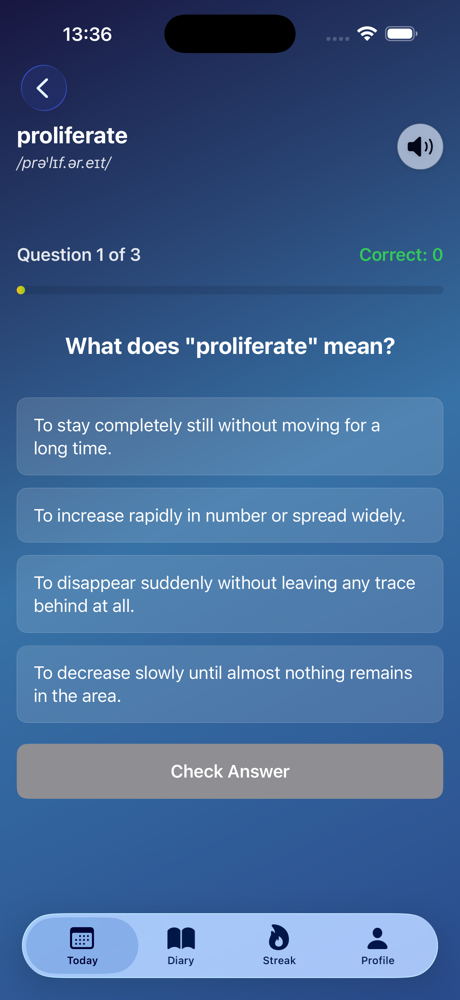
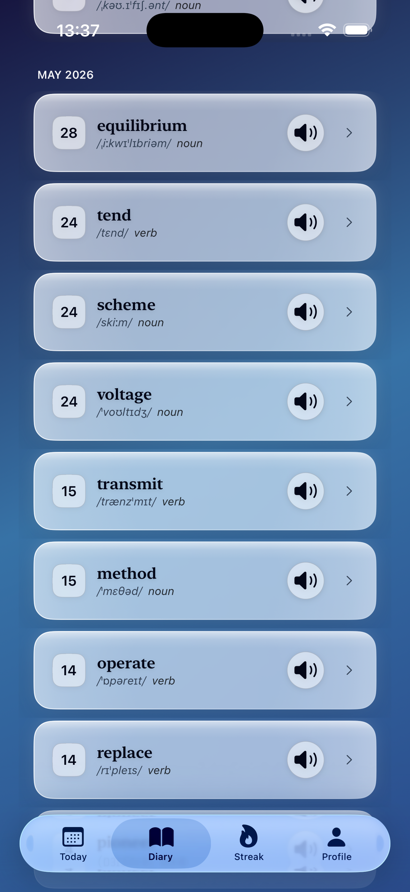
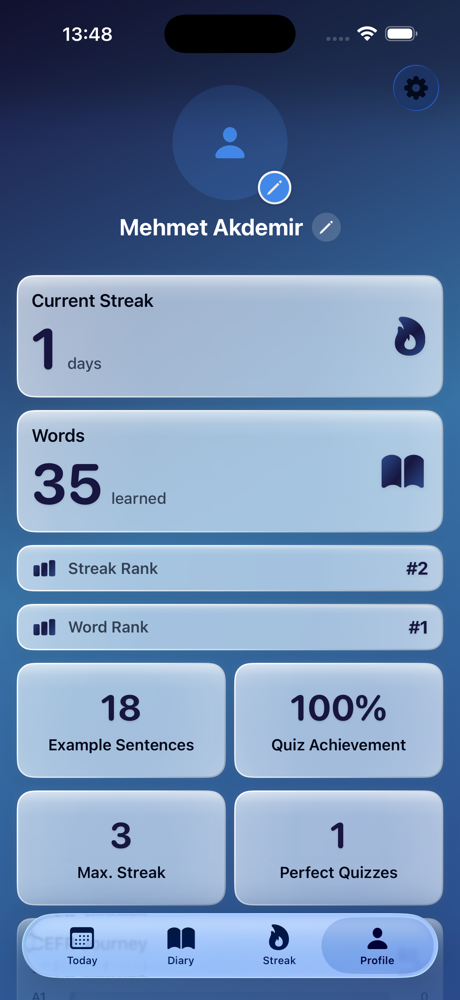

# Maia — Learn Vocab Daily

Published iOS vocabulary learning app. Daily words, quizzes, diary, streaks, and pronunciation.

**App Store:** [Maia — Learn Vocab Daily](https://apps.apple.com/app/id6763566092)

**Architecture:** [ARCHITECTURE.md](ARCHITECTURE.md)

## Screenshots

| Today | Quiz |
|:---:|:---:|
|  |  |

| Diary | Profile |
|:---:|:---:|
|  |  |

## Features

- CEFR-level daily vocabulary (offline word packs)
- Quiz engine with spaced practice
- Vocabulary diary with AI sentence correction (Firebase + Gemini)
- Streak tracking and profile stats
- Freemium: StoreKit subscriptions + AdMob (premium is ad-free)
- Localization via `Localizable.xcstrings`

## Tech stack

| Layer | Technologies |
|-------|----------------|
| iOS | SwiftUI, StoreKit 2, Google Mobile Ads, Sign in with Apple / Google |
| Backend | Firebase Auth, Firestore, Cloud Storage, Cloud Functions (Node.js) |
| AI / audio | Gemini API, Google Cloud Text-to-Speech |
| Content | Monthly JSON word packs, build scripts |

## Project structure

```
maia/              SwiftUI app source
ARCHITECTURE.md    System overview (stack + diagrams)
docs/screenshots/  App Store / portfolio screenshots
functions/         Firebase Cloud Functions
public/            Firebase Hosting (privacy, support, auth pages)
scripts/           Word pack & localization tooling
maiaTests/         Unit tests
```

## Setup (developers)

1. Clone the repository.
2. Copy `maia/GoogleService-Info.plist.example` → `maia/GoogleService-Info.plist` and fill in your Firebase project values (or use your own Firebase project).
3. Open `maia.xcodeproj` in Xcode 16+.
4. For Cloud Functions: see `functions/README.md` and set `GEMINI_API_KEY` via Firebase Secret Manager for deployment.

The app builds with test AdMob units in **Debug**; Release uses production ad unit IDs configured in `AdMobConfig.swift`.

## License

This project is licensed under the [MIT License](LICENSE).

## Author

**Mehmet Akdemir** — Boğaziçi University  
Solo developer: product, iOS, backend, and content pipeline.
